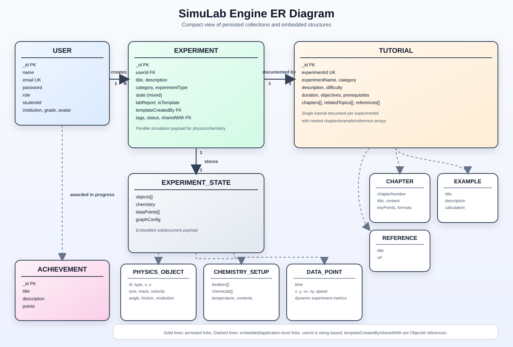

# SimuLab Engine ER Diagram

The rendered diagram is in [ER_DIAGRAM.svg](./ER_DIAGRAM.svg). Open that file to see the visual ERD.

## Notes

- `Experiment.userId` is stored as a string in the schema, but the API and UI treat it as the owning user reference.
- `Experiment.templateCreatedBy` and `Experiment.sharedWith` are modeled as MongoDB ObjectId references to `User`.
- `Tutorial.experimentId` is a unique string key used to look up the tutorial for a specific experiment slug or identifier.
- `Achievement` is currently a standalone collection; progress tracking in `src/lib/progressTracker.ts` keeps achievement IDs in memory rather than in a dedicated relational table.
- `Experiment.state` is a mixed document that can hold physics or chemistry simulation state depending on the experiment type.
- `Tutorial.chapters`, `chapters.examples`, and `references` are embedded arrays, so they are shown here as component entities for readability.
