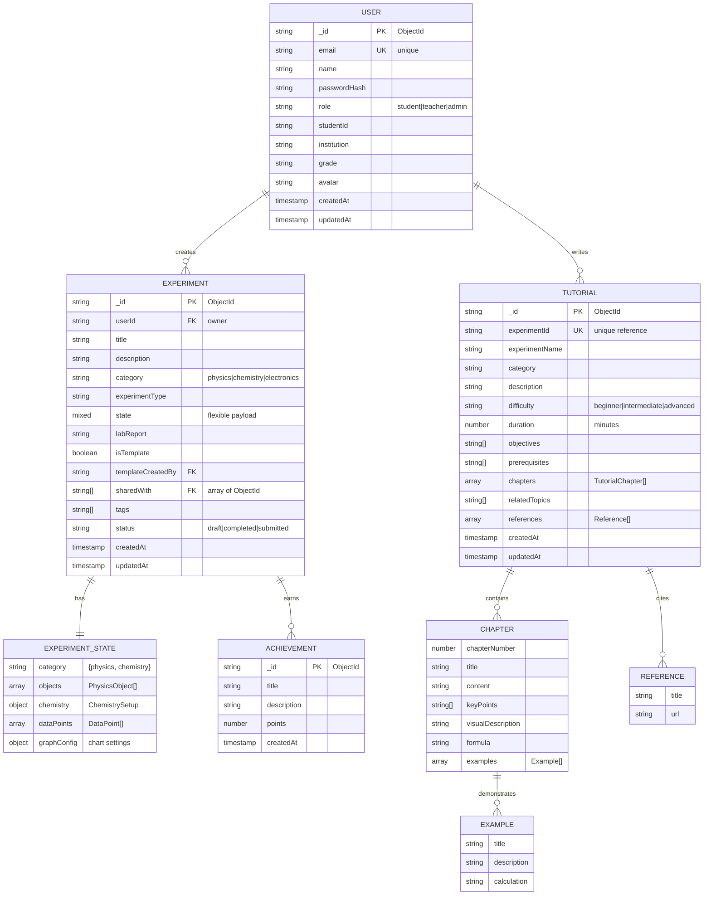

# SimuLab Engine ER Diagram - Mermaid Code

Use this code in **Gemini AI**, **Mermaid Live Editor**, or any tool that supports Mermaid syntax to generate a PNG.

## Copy This Code to Gemini:



---

## Alternative: ASCII Art Text Representation

If you prefer a simple text-based diagram for quick reference:

```
┌─────────────────────────────────────────────────────────────────────┐
│                    SIMULAB ENGINE - ER DIAGRAM                      │
└─────────────────────────────────────────────────────────────────────┘

┌──────────────┐
│     USER     │
├──────────────┤
│ _id (PK)     │
│ email (UK)   │◄──┐
│ name         │   │
│ role         │   │ 1:N creates
│ institution  │   │
└──────────────┘   │
       │ 1:N       │
       │ writes    │
       │           │
       ▼           │
┌──────────────┐   │
│   TUTORIAL   │   │
├──────────────┤   │
│ _id (PK)     │   │
│ expId (UK)   │   │
│ difficulty   │   │
│ chapters[ ]  │   │
│ references[]◄┼───┘
└──────────────┘   │
       │           │
       │ 1:N       │
    contains       │
       │           │
       ▼           │
  ┌────────────┐   │
  │  CHAPTER   │   │
  ├────────────┤   │
  │ title      │   │
  │ keyPoints[]│   │
  │ examples[] │   │
  └────────────┘   │
                   │
                   ▼ 1
        ┌──────────────────────┐
        │    EXPERIMENT        │
        ├──────────────────────┤
        │ _id (PK)             │
        │ userId (FK)◄─────────┘
        │ title                │
        │ state (mixed)────────┐
        │ isTemplate           │
        │ sharedWith[] (FK)    │
        │ status               │
        └──────────────────────┘
                   │
                   │ 1:1 has
                   ▼
      ┌──────────────────────┐
      │  EXPERIMENT_STATE    │
      ├──────────────────────┤
      │ objects[]            │
      │ (PhysicsObject)      │
      │ chemistry            │
      │ (ChemistrySetup)     │
      │ dataPoints[]         │
      │ (DataPoint)          │
      │ graphConfig          │
      └──────────────────────┘

┌──────────────┐
│ ACHIEVEMENT  │
├──────────────┤
│ _id (PK)     │
│ title        │
│ points       │
└──────────────┘
```

---

## How to Use in Gemini:

1. **Copy the Mermaid code** (the block starting with ` ```mermaid`)
2. Open **Google Gemini** (gemini.google.com)
3. Paste this message: *"Generate a database ER diagram PNG from this Mermaid code:"* and paste the code
4. Gemini will render it as a PNG image you can download

---

## Key Relationships:
- **USER** creates 1:N **EXPERIMENT** (one user, many experiments)
- **USER** writes 1:N **TUTORIAL** (one user, many tutorials)
- **EXPERIMENT** has 1:1 **EXPERIMENT_STATE** (flexible mixed document)
- **TUTORIAL** contains 1:N **CHAPTER** (tutorials have multiple chapters)
- **CHAPTER** demonstrates 1:N **EXAMPLE** (chapters have examples)
- **TUTORIAL** cites 1:N **REFERENCE** (external sources)
- **EXPERIMENT** may earn N:M **ACHIEVEMENT** (achievements awarded on completion)
